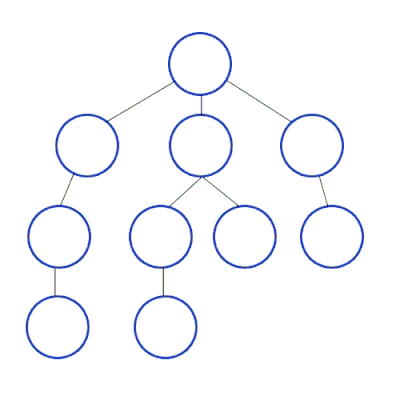

# Introducción a Prolog

## Python Meetup

### Carlos Emanuel Balcazar


### Introduccion

Prolog (PROgrammation en LOGique) es un lenguaje perteneciente al paradigma logico.

La Programación lógica, junto con la funcional, forma parte de lo que se conoce como Programación Declarativa, es decir la programación consiste en indicar como resolver un problema mediante sentencias, en la Programación Lógica, se trabaja en una forma descriptiva, estableciendo relaciones entre entidades, indicando no como, sino que hacer.

La programación lógica construye una base de conocimientos mediante reglas y hechos.


### Algunas caracteristicas

- No posee efectos colaterales
- No existe la nocion de tipos de datos
- Mecanismos de inferencia automática
- Recursion como estructura de control básica
- No posee un orden de ejecución, por lo cual lo hace no determinista
- No siempre es eficiente


### Hechos

Los hechos (o tambien los llaman axiomas en algunos libros) son una declaración o proposición cierta o falsa que establece una relación entre objetos.
Ver: [01_hechos.pl](fuentes/01_hechos.pl)

Hagamos algunas consultas para probar, por ejemplo podemos preguntar quien es la madre de maria:

```
madre(X, maria).
```

O al reves, de quien ES madre gina, la cual nos dara sus hijos/as:

```
madre(gina, X).
```
Incluso preguntar cuales son todas las madres y sus hijos:

```
madre(MADRE, HIJO).
```

### Reglas

Implicación o inferencia lógica que deduce nuevo conocimiento, la regla permite definir nuevas relaciones apartir de otras ya existentes.

Las reglas se escriben con el siguente formato:

```
cabeza de la regla :- cuerpo de la regla.
```

"X es mortal si X es humano, si la parte derecha falla, la regla da como resultado falso".

```
mortal(x) :- humano(x)
```

Ver: [02_reglas.pl](fuentes/02_reglas.pl)

Las reglas pueden ser tan complejas como se quiera, en este caso vemos el ejemplo de una base de conocimiento de familiares:


Ver: [03_reglas.pl](fuentes/03_reglas.pl)


### Operaciones Arimeticas

Prolog, como otros lenguajes de programación, es capaz de realizar
operaciones aritméticas. Aquí nos interesan solo las operaciones más
básicas que podemos realizar con números enteros. Veamos cómo se
expresan con el operador is:

suma

```
8 is 6 + 2.
```

resta
```
5 is 8 - 3.
```

multiplicacion
```
10 is 5 * 2.
```

division
```
4 is 36 / 12.
```

resto de una division
```
1 is mod(7, 2).
```

variables en una division
```
Resto is mod(83, 7).
```

otra forma de escribir las operaciones

```
is(X, +(3, 2)).
```

mayor y menor
```
2 > 5.
```

mayor igual
```
5 >= 5.
```

preguntar por igual
```
4 =:= 4.
```

preguntar por distinto
```
4 =\= 2.
```


### Listas

En prolog una lista es una representación de un conjunto de elementos.

La notación se hace utilizando los corchetes [].

Una lista vacia se hace con: [].

Una lista con elementos: [manzana, pera, bananas]

Una lista se puede ver como un predicado que tiene dos partes: `lista(cabeza | cola)`.

Podemos definir nuestro propio predicado que defina lo que es una lista y operar con ella:
Ver: [04_listas.pl](fuentes/04_listas.pl)

Probar ademas usar el comando trace para ver la secuencia de ejecución del programa.


### Backtracking

Prolog siempre consulta su base de conocimiento para verificar que hechos son verdaderos y asi permite la construcción de nuevas reglas, el mecanismo utilizado se conoce como "Backtracking" en donde el objetivo del recorrido es encontrar soluciones para algún problema. 

Esto se consigue construyendo soluciones parciales a medida que progresa el recorrido.
Estas soluciones parciales limitan las regiones en las que se puede encontrar una solución completa.

El recorrido tiene éxito si, procediendo de esta forma, se puede definir por completo una solución. En este caso el algoritmo puede bien detenerse (si lo único que se necesita es una solución del problema) o bien seguir buscando soluciones alternativas (si deseamos examinarlas todas).



